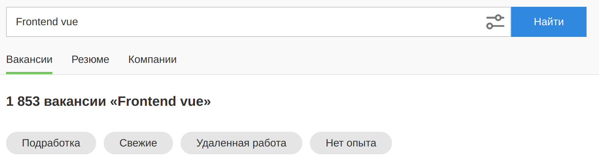
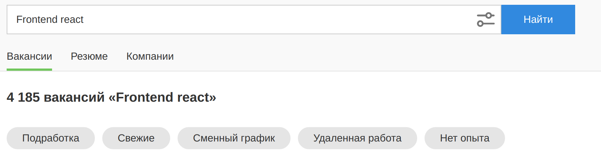
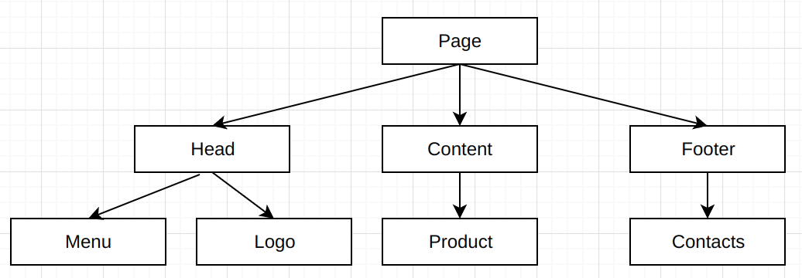

# React

## Введение

Знание JavaScript всегда было есть и вероятно будет, ключевым 
навыком любого фронтенд разработчика, без которого невозможно рабоатать. 
Но в современном, динамичном мире, одного лишь
знания языка уже недостаточно. Сайты на чистом JavaScript уже давно
стали редкостью, при разработки подавляющего большинства ресурсов, активно
используеют различные библиотеки и фреймворки. В результате, даже на позицию
джуниора, обычно ожидают кандидата, который уже владеет той или иной 
JavaScript библиотекой. Одной из самых популярных
(вероятно самой популярной) библиотек в мире фронтент разработки является - React,
именно с ней мы и познакомимся в данной статье.
Статья носит в первую очередь обзорных характер, мы познакомимся с основными
принципами и идеями React, что бы понять, что он из себя предвтаваляет, 
его преимучества и недостатки в сравнении с другими инструментами, 
рассмотрим небольшие куски кода.

## Что такое React. Зачем он нужен? 

Современные сайты уже давно перестали быть исключительно статичными информационными ресурсами,
сейчас они представляют собой полноценные приложения.
На сайтах можно покупать товары, общаться с друзьями, писать комментарий и т.д. 
Более того, изначально сайты представляли собой набор HTML документов, каждый из которых
открывался отдельной страницей, в результате передвижение по ресурсу было похоже на перелистывание
журнала. Но сейчас пользователи всё меньше хотят перезагружать страницы, им необходимо что бы 
интерфейс сайта работал бесшовно, словно нативное преложение, изменяя интерфейс динамически,
без перезагрузок. Поэтому современные сайты обычно представляют собой один HTML документ внешний
вид которого меняется динамически через JavaScript, такой подод получил название 
SPA (single page application). SPA делает сайты полноценными приложениями, которые не перезагружаеются
между переходами по страницам. Для реализации перехода между страницам в SPA требуетcя 
целиком перерисовывать контент документа с помощью JavaScript и полученных данных. Таким образом
современные интерфейсы намного более динамичны, чем их предшевствиники. А что же JavaScript и DOM API!?
Конечно, за последние годы, появилось много полезных методов и возможностей, но работа с DOM
попрежнему остаётся императивной из коробки, и выглядит примерно 
[так](https://codesandbox.io/s/3-1-2-bp0i2)):
```html
    <h1>Привет, Мир!!! Меня зовут <b class="js-name"></b>.</h1>
```

```js
function setName(name) {
  const nameWrapper = document.querySelector(".js-name");

  if (nameWrapper) {
    nameWrapper.textContent = name;
  }
}

setName("Вася");
```
Такой код может показаться удавлетоврительным, если нужно просто добавить имя пользователя в строку
приветствия,реализовать слайдер, или ещё какой нибудь небольшой кусочек автономной интерактивности. 
Но если мы делаем например SPA приложение, и нужно страницу корзины:

перерисовать в страницу оформленияз заказа:

То очевидно, решение такой задачи в лоб будет 
невероятно тудоёмко, придётся написать тысячи строк кода взаимодействия с DOM API, код будет
мало читабелен, и его поддержка в итоге станет пыткой. Применение библиотеки на подобии
[Jquery](https://jquery.com/) лишь поменяет интерфейс взаимодействия с DOM, но принципиально не решит проблем. И тут конечно,
вместо решения в лоб, можно попробовать написать свою реализацию 
[MV* паттерна](https://simpleone.ru/blog/mv-patterny-v-razrabotke-veb-prilozheniya/), настроить 
[дата биндинг](https://ru.wikipedia.org/wiki/%D0%A1%D0%B2%D1%8F%D0%B7%D1%8B%D0%B2%D0%B0%D0%BD%D0%B8%D0%B5_%D0%B4%D0%B0%D0%BD%D0%BD%D1%8B%D1%85),
построив свою систему рендеринга. Но опыт показывает, что такие решения сложно, почти невозможно, релазиовать 
на качественном уровне за короткий промежуток времени, в то же время, новым членам команды разработки,
обычно бывает сложно разобраться в чужой реализации паттернов т.к. все реализуют их по разному.
Подобные сложности в реализации рендеринга страниц сложных приложения, стали причинами появления
реактивных фреймворков и библиотек. Идея реактивности состоит в том, что бы вместо того, что бы каждый
раз вручную в коде в имеративном виде менять интерфейс приложения в соотвестветсвии с изменением данных, гораздо
удобнее изначально в декларавном виде задать связь между данными и их отображением и в дальнейшем в коде менять
только данные, а интерфейс будет автоматически перерисовываться под новые данные, и вручную в коде его менуть не 
придётся. Т.е. реактивный подход, подразумевает работу данными, в результате изменения которых автоматически
меняются и другие части программы в том числе интерфейс. React стал одной из первых и самой популярной на сегодняшний
день реактивной библиотекой для работы с интерфейсами. 

**React** — это декларативная JavaScript-библиотека для создания пользовательских интерфейсов.
Она позволяет собирать сложный UI из маленьких изолированных кусочков кода, называемых «компонентами».

Библиотека **React** предоставляет несколько синтаксисов для создания компонент:
1. Классовый
2. Функциональный

На сегодняшний день классовые компоненты используются редко т.к. синтаксис классов, в большинстве случаев,
оказывается излишен для описания компонент. Поэтому в статье мы будем рассматривать именно функциональные компоненты.
Дело в том, что, зависимость отображения интерфейса от данных, легче всего описать ввиде функции, которая на входе
получает данные, а на выходе возращает код описывющий интерфейс соответвующий этим данным. Код описывющий интерфейс
который необходимо сгенерировать React, представляет собой объект, который принятно называть React-элемент, таким
образом:

**Функциональный компонент в React** — это JavaScript-функция, которая на входе получает объект с данными, 
нужными для отрисовки компонента (называемыми props), а на выходе возвращает описание интерфейса, который нужно отобразить.

Пример с приветсвием польователя, на React может выглдяить [так](https://codesandbox.io/s/3-1-1-forked-6k2cnx?file=/src/hello-world.js:50-54):
```js
    import React from 'react';
    
    function HelloWorld (props) {
      return (<h1>Привет, Мир!!! Меня зовут <b>{props.name}</b></h1>);
    }
    
    export default HelloWorld;
```
Даже не зная синтаксиса React, в этом коде легко разобраться. В нём описана React компоннента ```HelloWorld```,
ввиде функции, которая на входе получает объект с данными ```props```, который содержит свойство ```name``` c именем
пользователя. Функция возращает специальный код, очень похожий на HTML разметку, с тем, что это такое мы разберёмся
в конце статьи. А сейчас важно понимать, что этот код работает, и React действительно отобразит на странице DOM дерево,
которое соответсвует той разметки, которую вернуло ```HelloWorld```, при этом, в отличие от обычного HTML, мы смогли
подставить в разметку данные из объекта props ```<b>{props.name}</b>```, тем самым шаблонизировав её.

Таким образом код на React выглядит намного легче и лаконичнее, вместо того, что описывать как нужно перерисовать интерфейс,
с помочью React, мы описываем что нужно отобразить на месте компонента используя синтаксис похожий на HTML. Такой
подход позволяет относительно легко решать и более сложные задачи, например, перерисовать разметку старницы корзины, 
и оторазить на её месте интерфейс страницы заказа, или произвести другие сложные перерисовки.

Кроме того, для своих перерисовок React использует так называемый Shadow DOM, что позволяет обновлять только изменившиется
узлы дом дерева, а не перерисовывать всю страницу целиком, это позволяет писать более эффектвные приложения, не расодующие
лишние ресурсы для перерисовок.

Поэтому React эффективно решает проблемы возникающие при разработки фронтенда у современных сайтов. В то время как при 
использовании классического JavaScript + HTML реализация сложных перерисовок интерфейса, может превратится в тиначеский
труд. При этом React не ограничивает возможности разработчика, как многие высокоуровневые фреймворки.

## Востребован ли React на рынке фронтенд-разработки? Сравнение с Vue. 

Все выше перечисленные преимучества, привели к тому, что на сегодняшний день, проекты на чистом JavaScript стали
экзотикой. Подавляющее большинство проектов используют реактивные фреймворки. При этому React был самым первым
популярным реактивным фреймворком во фронтенд и на сегодняшний день, React - это самый популярный фронтенд фреймворк.
Востребованность рынка в толковых React разработчиках необыкновенно высока. В результате, на сегодняшний день, владение
чистым JavaScript важно, но без знаний какого нибудь из реактивных фреймворков, например React, устроится на работу,
даже джуниором, достаточно сложно. В тоже время, овладев React, вы вероятнее всего сможете очень быстро трудоустроится,
найдя работу, среди множества вакансии React разработчиков.

Конечно React это далеко не единственный фронтент инструмент используючий реактивный подход, похожих решений достаточно
много. Если попытаться сравнить React c другими современными реактивными библиотеками и фрейморками, такими как Vue или Angular, 
можно столкнуться с противоречивыми мнениями. Кто-то считает, что React — самый быстрый
и простой в изучении инструмент. Кто-то скажет, что именно Vue — самый простой в изучении фреймворк, 
что он гораздо удобнее и эффективнее, чем React. Ещё больше неоднозначности добавляют различные статьи. 
В одних разработчики рассказывают, как они переписали своё приложение «с неудобного Vue на замечательный
React». В других рассказывается про специалистов, переписавших сайт «с неуклюжего React на простой и понятный Vue».

На наш взгляд, такие противоречия вызваны тем, что современные фреймворки достаточно похожи друг на друга. 
Конечно, каждый из них имеет свои преимущества и недостатки, но все они в конечном счёте нивелируют друг друга. 
В результате все популярные фреймворки оказываются примерно одинаково эффективными. Поэтому, не имея чётких метрик, 
специалисты при сравнении фреймворков часто полагаются на субъективные мнения. Например, если команда целый год 
переписывала сайт с Vue на React, то, разумеется, все члены команды скажут, что React гораздо
лучше. И наоборот. Поэтому не стоит тратить время на сравнение разных реактивных фреймворков. 
Вместо этого лучше изучить как минимум один из них. Тем более, что все эти инструменты не статичны во времени,
они постоянно совершенствуются и обновляются, для того что бы предоставлять своим пользователям наилучший девелопер
экспиранс.

Поэтому, если говорить о разработке, то у React нет принципиальных преимуществ в
сравнении например с Vue, есть только некоторые различия, которые невелируют друг друга.
Но в тоже время у React есть неоспоримое преимущество с точки зрения трудоустройства. 
Оно состоит в том, что React — самый популярный на 2022 год инструмент фронтенд-разработки. 
Поэтому React-специалисты востребованы, и, освоив React, можно легко найти работу.

> Важно отметить, что по документации React является библиотекой, а Vue и Angular — фреймворками. Поэтому формально мы не 
> должны их сравнивать.
> Однако из-за различных переходных вариаций, таких как «прогрессивный фреймворк», 
> и других особенностей на практике различия между библиотеками и фреймворками во фронтенде иногда оказываются 
> не столь значимыми. Поэтому при разработке интерфейсов мы обычно выбираем не между библиотеками и фреймворками, 
> а между конкретными инструментами, и сравниваем именно их.

Вы можете убедиться в этом сами, если зайдёте на любой сайт по подбору персонала. Например, если на популярном [ресурсе](https://spb.hh.ru/) по поиску работы поискать вакансии для Vue-специалиста, то на момент написания учебника будет найдено 1853 вакансии:




Но если тот же самый запрос указать для React, то будет найдено уже 4185 вакансий, что в разы больше, чем у других конкурирующих инструментов:



Поэтому преимущество в востребованности React над другими фронтенд-инструментами пока что неоспоримо.

Таким образом, если вы прежде ещё не сталкивались с реактивными фреймворками, то мы не рекомендуем откладывать их изучение
на потом, или долго размышлять о том, что изучать: React или Vue. Вместо этого, лучше скорее перейти к изучению любого
из современны реактивных фронтенд фреймворков. Ведь не важно освоите вы React или Vue, они оба востребованы, поэтому
владея на хорошем уровне, любым из них, вы сможете без труда трудоустроится на вакансию с достойной заработной платой.
При этом т.к. React всё же востребован сильнее других инструментов, для более быстрого трудоустройства, мы рекомендуем
изучить именно его.
А если вы уже влдаете одним из популярных инструментов, например Vue, то изучение React тоже не стане для вас лишним,
оно значительно расширит спектр ваканссии на которые вы сможете претендовать, а так же заметно расширит профессиональный
кругозор.

## Типовые задачи React разработчика.

Как мы уже прежде отмечали, React - это фреймворк для работы с отображением, тем, что во фронтенд принято называть
"вьюхами". React позволяет разрабочтику представить страницу ввиде набора компонент, какждая из которых, на основе полученных 
данных генерирует нужный кусочек интерфейса в декларативном виде, а так же автомтически перерисовывается при изменении
данных, что бы интерфейс всегда выглядел актуально. Поэтому типовые задачи React разработчика, состоят в написании
таких React компонент. Далее из компонент, строятся страницы сайта, представляющие собой дерево составленное из уже готовых
кусочков интерфейса.

Т.к. реактивные фреймоврки - это программирование на основе работы с данными, то при работе с React, очень важно знать
тип данных который приходит в компонент. JavaScript не возволяет явным образом описывать типы данных в коде. Поэтому
React разработчики обычно используют в проектах [TypeScript](https://www.typescriptlang.org/) - этот языка является
над множеством над языком JavaScript, предоставляющий дополнительный синтаксис для описания типов данных и работы
с ними. 

React неверноятно популярен, и в то же время это узко направленная библиотека отвещающая за отображение интерфейса. По этому
во круг React есть целая экосистема инструментов, решающих остальные задачи фронтенд разработки:
1. Управление состоянием - библиотеки, отвещающие за работу с глобальными данными приложения, теми данными, которые
не относятся к конкретному компоненту, а нужны во многих частях сайта. Среди популярных инутрументов,
для управления состоянием можено выделить: [Redux](https://redux.js.org/), [Mobx](https://mobx.js.org/) и т.д.
2. Роутинг. SPA подразумевает отображение страницы без дополнтиельных запросов к серверу. Поэтому задача роутинга, т.е.
соотвествия страниц определённым url, становится задачей фронтенд разработчика, и для её решения так же есть ряд популярных 
библиотек, в частности [ReactRouter](https://reactrouter.com/)
3. Серверный рендеринг. Одна из проблем SPA состоит в том, что многие поисковики, ожидают конкретный HTML, а не JavaScript.
Поэтому многим проектам, важно отдавать на запросы поисковиков, не путой HTML файл, на котором в дальнешим JavaScript
отрисует интерфейс, а уже готовую HTML разметку. Для генерации HTML разметки из компонент разработан  фреймворк 
[Next.js](https://nextjs.org/).
4. Типовые UI элементы обычно не пишут с нуля, вместо этого как правило используют готовые ui библиотеки, такие как:
[MUI](https://mui.com/), [Ant Design](https://ant.design/docs/react/introduce) и многие другие.
5. Для стилизации вместо обычного css с React часто используют подход ```СSS in JS```, который повзоляет
описывать стили прямо в JavaScript. Одной из самых популярных имплементаций подхода ```СSS in JS``` является
библиотека [styled-components](https://styled-components.com/)
6. И это далеко не полный список, с которыми работает React разработчик в повседневной жизни, экосистема React огромна.

Поэтому, как правило под термином "React разрботчиком", подразумевают не только знание самой библиотеки React, но и владение
другими библиотеками, которые обычно используются вместе с React, например стейменеджером Redux.

## Работс с React.

Рассмотрим синтаксис написания React компонент более подробно. React компонент это JavaScript-функция, 
которая на входе получает объект с данными,
нужными для отрисовки компонента (называемыми props), а на выходе возвращает React-элемент.

**React-элемент** — это JavaScript-объект, описывающий узел DOM-дерева.

Он имеет специальный формат, который React умеет обрабатывать и отображать на странице.
Для создания таких объектов библиотека React предоставляет метод ```React.createElement```.

Таким образом, чтобы создать на странице разметку вида...
```js
<p>Тяжело читать <b>React.createElement</b>!!!</p>
```
можно написать React-компонент:

```js
import React from "react";

function HelloReact() {
  // не нужно думать, что это такое, дальше мы будем использовать JSX  
  return React.createElement(
    "p",
    {},
    "Тяжело читать ",
    React.createElement("b", {}, "React.createElement"),
    "!!!"
  );
}
```

Как видно, react компонент, это просто обычная JavaScript функция, которая на входе может получать данные в виде объекта,
а на выходе возращает объект формата React-элемент, созданый на основе метода ```React.createElement```, который прердоставляет
библиотека ```React``` и описывает кусочек интерфеса который нужно отобразить на месте компонента.

Очевидно, что вызовы ```React.createElement``` не выглядят интуитивно понятными, глядя на код, сложно сразу разобраться,
что будет выведено на страницу, поэтому```React.createElement``` обычно напрямую не применяется, а используется специальный синтаксис
JSX.

**JSX** — это расширение языка JavaScript, которое позволяет описывать интерфейс используюя синтаксис поожий на HTML, прямо
в JavaScript коде.

С использованием JSX пример будет выглядить [так](https://codesandbox.io/s/3-1-1-forked-j20tdm?file=/src/hello-react.js):

```js
import React from "react";

function HelloReact() {
  return <p>Тяжело читать <b>React.createElement</b>!!!</p>
}
```
Теперь, с применением JSX код компонента стал намного понятнее, сразу видно какой кусок дом дерева описывает данный компонент.

В отличие от статического HTML, JSX позволяет шаблонизировать разметку, подставляя в неё данные вычисленные из
JavaScript выражений, для этого используется синтаксис фигурных скобок. Если переписать пример из самого начала статьи
на React то он может выглядить [так](https://codesandbox.io/s/3-1-1-forked-6k2cnx?file=/src/hello-world.js:50-54):

```js
    import React from 'react';
    
    function HelloWorld (props) {
      return (<h1>Привет, Мир!!! Меня зовут <b>{props.name}</b></h1>);
    }
    
    export default HelloWorld;
```
Здесь компонент ```HelloWorld``` получает в объекте props имя пользователя ```name``` и на основе этих данных возвращает
нужную разметку ```<h1>Привет, Мир!!! Меня зовут <b>{name}</b></h1>```. Балгодаря синтаксису фигурных скобок значение
из переменной ```name``` подставляется в JSX. Код React компонента в сравнении с чистым JavaScript выглядит намного понятнее.
Всё дело в том, что в JavaScript, из коробки, мы вынуждены описывать интерфейс в императивной форме, явно указывая действия
которые должен выполнить движок, для того, что бы получить нужное нам отображение страницы т.е. в коде содержаться
указания на подобии: найди такой то элемент, запиши туда такой то текст, добавь туда такой то элемент и т.д.
Читая подобый код, очень сложно понять конечный результат, не имея в голове движка JavaScript. В тоже время, в React,
используется декларативный подход, нам не нужно описывать действия для отрисовки интерфейса, вместо этого,
в компоненте мы показываем как превратить полученные данные внужную JSX разметку, а задачу по выполнению нужных действий
по изменению интерфейса берёт на себя сам React.

> Важно учитывать, что браузер ничего не знает про JSX и не умеет его интерпритировать, поэтому, при использвании
> JSX нужно настроить сборку проекта таким образом, что бы JSX автоматически трансформировался в соотвествующие
> JavaScript объекты и в браузер попадал только чистый JavaScript. Для этого есть Babel плагины, а так же
> проекты на подобии CreateReactApp. В статье мы используем онлайн IDE [codesandbox](https://codesandbox.io/),
> которая предоставляет готовый шаблон для React проектов.

В какой то смысле описание изменения интерфейса вручную, напрямую, через DOM API, похоже на приготовление
блюда по рецепту, мы вынуждены описывать каждый шаг изменения инетерфейса и пока такой рецепт не дочитаешь до конца, сложно
понять конечный результат. В тоже время, использование React сродни походу в ресторан, в нём мы просто описываем то блюдо,
которое хотим получить из данных, а React уже сам решает, какие операции ему необходимо совершить, для того, что бы приготовить
заказанное блюдо, отобразив на экрене нужный интерфейс. Разумеется ходить в ресторан, обычно приятнее,
чем готовить самостоятельно, особенно если ресторан бесплатный как React и имеют такую популярность во фронтенде.

Теперь, разобравшись с компонентами, осталось разобраться с тем как заставить React вывести полученную из компонента
JSX разметку на экран. Для этой цели React предоставляет метод ```ReactDOM.render```. Первым параметром в ```ReactDOM.render```
передаётся JSX разметка, которую необходимо вывести на страницу, а вторым параметром передаётся узел DOM дерева, в который
нужно вставить данный кусочек интерфейса. В результате для того, что бы вывести компонент HelloWorld в DOM узел с id root,
нужно [написать](https://codesandbox.io/s/3-1-1-forked-g70hmn?file=/src/index.js):
```js
    import ReactDOM from "react-dom";
    import HelloWorld from "./hello-world";
    
    const rootElement = document.getElementById("root");
    ReactDOM.render(HelloWorld({name:'Вася'}) , rootElement);
```
Здесь вызов ```HelloWorld``` c объектом ```{name:'Вася'}``` вернёт нужную JSX разметку, а ```rootElement``` хранит
ссылку на DOM элемент с id root. В результате вызов ```ReactDOM.render(HelloWorld({name:'Вася'}) , rootElement)```, добавит
полученый из компонента интерфейс в нужный DOM узел.
Приэтом вызывать компоненты в ручную, как функции, на самом деле не нужно. Вместо этого в JSX можно вставлять компоненты,
как обычные HTML теги, передавая данные через атрибуты, так словно, это обычный html тег. При отрисовки на экране, наместе
компонента в JSX, будет выведена, та разметка которую вернёт компонент.

> Важно учитывать, что имя компонента в JSX должно начинаться с большой буквы, иначе JSX будет идентифицировать его как
> обычный HTML тег, а не компонент.

Таким образом, вместо: ```ReactDOM.render(HelloWorld({name:'Вася'}) , rootElement);``` обычно пишут:
```ReactDOM.render(<HelloWorld name="Вася" /> , rootElement);```.

Возможность вставлять в JSX помимо HTML тегов, свои компоеннты, является одним из важнейши приёмов в React. Дело в том,
что страницы сайта обычно бывают намного сложнее чем пример Hello World, они состояте из сотен или даже тысяч HTML элементов,
и попытаться описывать такую страницу в одном модуле, одном компоненте - это очевидно плохая идея, код превратится огромную нечитабельную
простыню. Поэтому страницы обычно разбивают на более маленькие кусочки интерфейса, и каждый из них реализуют в
в виде отедльного компонента. Этот приём в React называют **композицией компонент**. Тот же самый примпер с HelloWorld можно
представить в виде композиции двух более маленьких компонент:
```js
// компонент Name
import React from "react";

function Name(props) {
  return <b>{props.name}</b>;
}

export default Name;
```

```js
// компонент HelloWorld
import React from "react";
import Name from "./name";

function HelloWorld(props) {
    return (
        <h1>
            Привет, Мир!!! Меня зовут <Name name={props.name} />
        </h1>
    );
}

export default HelloWorld;
```
Теперь за отрисовку имени пользователя отвечает компоент ```Name``` и он может быть использован не только в HelloWorld,
но и в любой другой части интерфейса, где необходимо вывести имя пользователя. Для более сложны страниц композция может
быть более большой например такой:



Таким образом интерфейс в React представляет собой дерево компонент, каждая из которых отвечат за свой кусочек интерфейса.
Так данные передаются каждой компоненте через props, то все необходимые для данные компонент должен получать от родительского
компонента, который может передать их через атрибуты, а родительский компонент, от своего родителя и так далее.
Таким образом поток данные в React однонаправленный, данные передаются от родительского компонента к дочерним, это делает
работу с данными более предсказуемой и понятной.

Разумеется интерфейсы в React динамичны и мы всегда можем перерисовать их в ответ на действия пользователя, для этого React
предоставляет React хуки.

**Хуки (от англ. hook, «цеплять»)** — это функции, которые позволяют изменить стандартное поведение системы собственным кодом.
При этом интерфейс функции ограничивает эти изменения безопасными для системы пределами.

В случае с React хуки позволят управлять жизненым циклом компонента, позволяя в нужный момент вызвать например перисовку
компонента.

В результате счётчик на React может выглядить [так](https://codesandbox.io/s/5-3-2-o2c68?file=/src/counter.js):

```js
import React, { useState } from "react";

export default function Counter({ initValue }) {
  const [value, setValue] = useState(initValue || 1);

  return (
    <div>
      <button type="button" onClick={() => setValue(value - 1)}>-</button>
      <span> {value} </span>
      <button type="button" onClick={() => setValue(value + 1)}>+</button>
    </div>
  );
}
```
Здесь ```useState``` - это специальный реакт хук для хранения состояния компонента, когда состояние меняется, это
вызывает перерисовку компонента. При вызове useState возращает массив первым элементом которого является значение состояния,
а во втором элементе хранится функция сеттер, с помочью которой можно менять значение состояния. Для кнопок, передан
props onClick, в который записаны функции, которые должны быть выполнены по нажатию на кнопку. В результате, по нажатию
на кнопки, вызывается ```setValue```, в новым значением состояния, что вызывает перерисовку, и на экране отображается,
актуальное значение ```value```. Таким образом перерисовки в React так же работают на основе данных, мы не описываем в
императивной форме что нужно перерисовать, вместо этого мы меняет данные, а React уже сам понимает, как нужно перерисовать
интерфейс, что бы он соотвествовал новым данным.

> useState это только один из множества доступных хуков, более того, при необходимости разработчик может писать свои кастомные
> хуки.

Таки образом сравнивая работу с интерфейсам через нативный JavaScript с React, легко заметить следующие плюсы:

1. React предоставляет декларативное описание интерфейса - с ним намного удобнее работать, чем вереницей императивных инструкций DOM API
2. React самостоятельно решает какие узлы DOM дерева в какой момент обновлять. Он не делает лишних операций, это делат код на React быстрее, чем большинство наивных реализаций на чистом JavaScript.
3. React отлично документирован, в то время как самописные решения для реализации датабиндинга, обычно блохо задокументированы или вообще незадокументированы
4. Благодаря JSX в одном компоненте мы видим и логику, и разметку с которой должна работать данная логика,
   как правило они неразрывно связаны и видить их рядом намного удобнее, чем отдельно хранить HTML и JavaScript
5. Разбиение кода на компоненты, позволяет переиспользовать код.

## Выводы

React невероятно востребован в мире современной Frontend разработки, для подавляющего большенства специалистов,
это своего рода инструмент по умолчанию, для написания интерфейсов. Таки образом знание React значительно облегчает
трудоустройство, и способствует получению более высокой зарплаты. Поэтому для современного фронтенд разработчика,
как правило не стоит вопроса о том изучать ли React, скорее воспрос состоит в том, когда начить изучать React и
как это сделать.
Популярность данной бибилиотеки, привела к тому, что многие пытаясь стать 
фронтенд разработчиком, сразу начинают изучать React - но это грубая ошибка, React - это всего лишь JavaScript библиотека,
и ею нельзя овладеть без знания самого JavaScript. Поэтому если вы ещё только начинаете свой путь во фронтенд, то нужно
начинать с базовых знаний: JavaScript, HTML, CSS и лишь потом переходить к React. Так же, для более эффективного применения
React полезно изучить TypeScript, тем более, что в большинстве проектов на React используется именно TypeScript. При изучение
самого React, лучше уделить больше времени функциональному синтаксису написания компонент т.к. на сегодняшний день он применятся
в подавляющем большинстве проектов, а на классовых компонентах как правило осталось написанным только "легаси".
При изучении React важно учитывать, что хоть React формально и является библиотекой, но по факту это не просто набор функций.
У React есть своя филолософия, свои приёмы и ограничения, которые важно соблюдать, для того, что бы писать
качественный код. Поэтому при изучении React важно не просто выучить синтаксис, но и общатсья с более опытными коллегами,
показывать им свой код, для того, что бы научится использовать React правильно.
Посути в React нет инчего сверх естественного, чего было бы сложно изучить, главное иметь время, желание и хорошие обучающие 
материалы.


